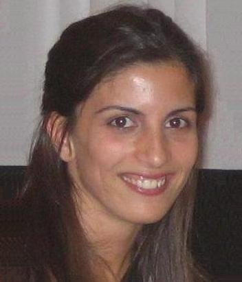

<!---  
# Mariana S. C. Almeida 
<table><tr><td>
</td></tr></table>
<kbd></kbd>
-->

 

 

[Go to Heading section] (#-this-is-a-heading)

<!---  
boarder="100px solid blue" width="180" padding="200px" margin="20px"
padding="5px"
0 10px
margin:20px 30px
padding-left
padding-right
 box-sizing="border-box"

https://github.com/MarianaAlmeida/marianaalmeida.github.io/blob/master/
&nbsp;
-->

 

Since december 2019, I am Head of Research at [Cleverly](https://cleverly.ai/) in Lisbon, Portugal,where we drive NLP (Natural Language Processing) and ML (Machine Learning) to help customer support teams becoming more efficient.

Before that I researched for 6 years in industry: 4 years at [Priberam Labs](http://labs.priberam.com/) where I developed ML methods to solve NLP problems and 2 years at [Feedzai](https://feedzai.com/) where I worked on ML approaches for preventing fraud.

Until 2013 I mostly worked on image processing in academia. I was a Postdoc fellow at [IT](https://www.it.pt/) of Lisbon, working on image reconstruction under the supervision of [Mário A. T. Figueiredo](http://www.lx.it.pt/~mtf/). And my PhD was in the field of blind image separation and blind deconvolution, under the supervision of [Luís B. Almeida](http://www.lx.it.pt/~lbalmeida/)

<!--- , at [IT](https://www.it.pt/) of Lisbon, Portugal.-->

 ___

# This is a heading

 ___
 
