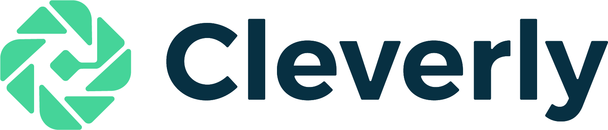

<!---  
# Mariana S. C. Almeida 
<table><tr><td>
</td></tr></table>
<kbd></kbd>
https://github.com/fefong/markdown_readme/blob/master/README.md
https://raw.githubusercontent.com/fefong/markdown_readme/master/README.md
https://www.markdownguide.org/basic-syntax#headings
[a relative link](another-page.md)
-->

 

 

 &nbsp; &nbsp; &nbsp;  

 

 &nbsp; &nbsp; &nbsp; [**News**](#news)  &nbsp;  [**Degrees**](#degrees)  &nbsp; [**Awards**](#awards) &nbsp; [**Publications**](#publications) &nbsp; [**Contacts**](#contacts)

 

<!---  
boarder="100px solid blue" width="180" padding="200px" margin="20px"
padding="5px"
0 10px
margin:20px 30px
padding-left
padding-right
 box-sizing="border-box"

https://github.com/MarianaAlmeida/marianaalmeida.github.io/blob/master/
&nbsp;
-->

Since december 2019, I am Head of Research at [Cleverly](https://cleverly.ai/) in Lisbon, Portugal. We drive NLP (Natural Language Processing) and ML (Machine Learning) to make customer support teams more efficient.

Before that I worked as a researcher in industry for 6 years: 4 years at [Priberam Labs](http://labs.priberam.com/) where I explored ML and NLP methods and 2 years at [Feedzai](https://feedzai.com/) where I worked on ML and deep learning methods for fraud prevention.
<!--- methods to solve--> <!--- problems -->

Until 2013 I mostly worked on image processing in academia. I was a Postdoc fellow at [IT](https://www.it.pt/) of Lisbon, working on image reconstruction under the supervision of [Mário A. T. Figueiredo](http://www.lx.it.pt/~mtf/). And my PhD was in the field of blind image separation and blind deconvolution, under the supervision of [Luís B. Almeida](http://www.lx.it.pt/~lbalmeida/)

<!--- , at [IT](https://www.it.pt/) of Lisbon, Portugal.-->

___

# News 

* some *blue* text

* **Hiring:** [Cleverly](https://cleverly.ai/) got a european **SME Innovation Associate** grant to hire a PhD in NLP or a Reaseracher with equivalent experience for one year. If you are interested, see more details here or [contact me](#contacts)!

* I am co-organizing [LxMLS 2020](http://lxmls.it.pt/2020/). This year it will be a **fully virtual on-line school**.

* In december 2019 I joined [Cleverly](https://cleverly.ai/) :-) We are building AI-driven solutions that make customer support teams more efficients!

___

# Degrees 

* PhD in Electrical and Computer Engineer (2010) from [Instituto Superior Técnico](https://tecnico.ulisboa.pt/pt/)  (IST), [Universidade de Lisboa](https://www.ulisboa.pt/) (ULisboa).
PhD Thesis: "Blind separation and blind deblurring of natural images," October, 2010.  ([PDF](http://www.lx.it.pt/~mscla/MA_pdfs/PhDThesis_MarianaAlmeida2010.pdf))

* Five year degree in Electrical and Computer Engineer (2005) from [Instituto Superior Técnico](https://tecnico.ulisboa.pt/pt/)  (IST), [Universidade de Lisboa](https://www.ulisboa.pt/) (ULisboa).
Final Project: "Extensions to Denoising Source Separation," Neural Networks Research Center of the Helsinki University of Technology (HUT; now [Aalto University](https://www.aalto.fi/en)); [Instituto Superior Técnico](https://tecnico.ulisboa.pt/pt/) (IST), October, 2005. ([PDF](http://www.lx.it.pt/~mscla/MA_pdfs/MarianaSCAlmeida_TFC_05.pdf))

# Awards 

* Honorable mention at the Portuguese [IBM Scientific Prize](https://www.ibm.com/;www-05.ibm.com/pt/pc/premio.html) in 2010, for her work on blind image deblurring.

* [Prémio Prof. Luís Vidigal 2004/2005](http://premio-vidigal.inesc.pt/), for her final project on on extensions to denoising source separation.

___

# Publications

___

# Contacts

 

&nbsp; 
&nbsp; 

<!--- 
&nbsp;[https://www.linkedin.com/in/marianaalmeida/](https://www.linkedin.com/in/marianaalmeida/)
marianascalmeida @ gmail.com
mariana @ cleverly.ai
https://stackoverflow.com/questions/37413679/how-to-add-a-linkedin-link-to-jekyll-pages-on-github
https://raw.githubusercontent.com/carlsednaoui/gitsocial/master/README.md
https://github.com/carlsednaoui/gitsocial
-->

